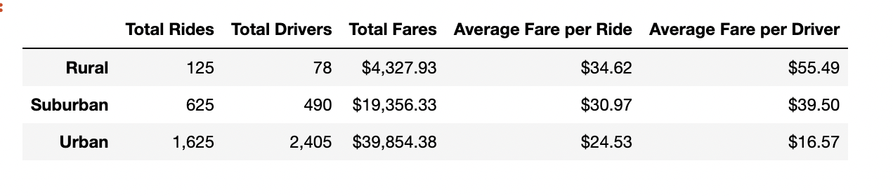
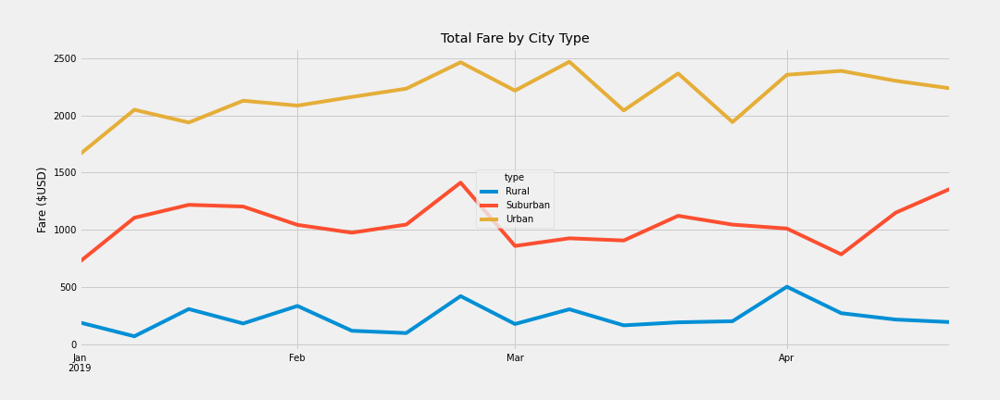

# PyBer_Analysis

# Overview of the analysis

## Purpose

The purpose of the new analysis is to evaluate the ride-sharing data, group the data by city type, and then, to create a multiple-line graph that shows the total weekly fares for each city type. The findings of the analysis are to be utilized by the decision-makers at Pyber to improve access to ride-sharing services and determine affordability for underserved neighborhoods.

# Results

As seen from the chart above, urban cities had more total drivers than total rides, which led to lower average fare per ride and per driver than in suburban and rural areas. However, the total fares revenue was highest in urban cities due to the highest ridership demand. 

Rural cities saw the highest average fare per ride and per driver due to limited number of drivers and while the number of total rides in the rural areas is higher than the total number of drivers, the demand for ridesharing appears to be low. 

The above information is further collaborated by the multiple-line chart found below, “Total Fare by City Type,” showing ridesharing fare information from January 1, 2019 to April 29, 2019. As suspected, urban cities saw higher demand and higher revenues for ridesharing services, followed by suburban cities, and rural communities. 

Based on the multiple-line chart, the rising demand for ridesharing fell on the second half of February across all three city types. The ridesharing continued to be in demand in urban areas well into April, while the suburban and rural cities saw a decrease in March, with another peak in the beginning of April for rural cities, and middle of April for suburban cities. 

# Summary
 
A further study is necessary to see the correlation between the average fares in rural, suburban, and urban cities. 

A larger travel distance might be contributing to the higher fares for rural and suburban areas. 

Additional data on the correlation of population and geographical territory might help in understanding the demands for ride-sharing services, in particular in rural areas. 

It would be reasonable to increase advertising for ridesharing services in urban areas due to large driver availability, thus leading to higher revenues. 

